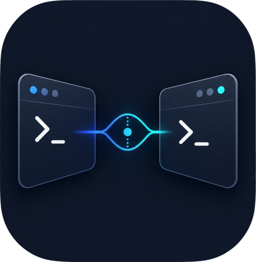

<p align="center">
  
</p>

<h1 align="center">lookover</h1>

<p align="center"><b><i>look over your shoulder</i></b> — into your other Claude Code terminals.</p>

<p align="center">
  Ask one terminal what <b>another Claude Code session</b> is doing.<br>
  Its context is injected automatically, just mention it.
</p>

<p align="center">
  
  
  
  <a href="https://espigah.github.io/lookover/"></a>
</p>

---

Every Claude Code session runs blind to the others: the Claude in terminal A can't see terminal B.
**lookover** closes that gap. You reference another terminal, by name or by description, and its
context enters your prompt before Claude answers, like glancing over your own shoulder at the
session next to you.

```
you:  based on the slack-bridge-on-2 terminal, what was the last PR we reviewed?
you:  in the terminal where I handle on-call, why wasn't the xpto alert handled?
```

## How it works

- **Capture (100% Go, zero tokens):** a lightweight hook records a tight digest of each session
  (topics extracted from the prompt, the skill in use, facts) in
  `~/.claude/lookover/<sessionId>.*.json`. Never stores verbatim content.
- **Resolve:** when it detects you mentioned another terminal, it scans `~/.claude/sessions/`
  (native) plus the metas and ranks by lexical score (name > topics > repo > fact > skill). Finds
  the right session, returns a shortlist on a tie, or tells you which ones are open.
- **Inject:** the context enters as `additionalContext`, inside an anti-injection envelope
  (marked as data, not instructions) and sanitized.

## Two levels of context

| You write | What gets injected |
|---|---|
| *"what did terminal X do?"* | **summary**: topics + asks (cheap, for identification) |
| *"show me the **full text** from terminal X"* | **verbatim content** read from the session's real transcript |

Deep mode is triggered by cues like *"full text", "verbatim", "what was written", "the whole thing",
"in full"*.

## Install

Requires Go 1.21+ and Claude Code.

```sh
git clone https://github.com/Espigah/lookover.git
cd lookover
go build -o ~/.local/bin/lookover ./cmd/lookover
lookover init        # shows the settings.json diff and only applies after you confirm
```

`init` registers 4 hooks (SessionStart, UserPromptSubmit, PostToolUse, Stop), **preserves** existing
hooks, makes a backup (`settings.json.bak`), registers already-open sessions (backfill) and offers
to install a primer in `CLAUDE.md`. Roll back: `lookover uninstall`.

Flags: `--llm` (enable the optional LLM compaction), `--shadow` (capture without injecting),
`--yes` (no prompt), `-g` (global).

## Commands

| command | what |
|---|---|
| `lookover list` | live sessions + skill/topics |
| `lookover show <name\|id>` | a session's digest |
| `lookover doctor` | health diagnostics |
| `lookover status` | local usage/adoption |
| `lookover uninstall` | remove the hooks |

## Robustness & security

- **Zero cost in normal use:** with no reference to another terminal, the hook injects nothing.
- **Never breaks Claude:** panic recovery, anti-hang watchdog, always exits 0.
- **Anti prompt-injection:** the summary never stores verbatim output, only derived facts; injection
  is always enveloped and sanitized.
- **Kill switch:** `touch ~/.claude/lookover/disabled` (or `LOOKOVER_DISABLED=1`) turns it off instantly.
- **No server:** one file per session, atomic writes, resolution via a local scan.

## Development

```sh
go build ./...
go test ./...
```

Packages under `internal/`: `paths`, `config`, `sessions`, `store`, `hookio`, `capture`, `resolve`,
`render`, `digest`, `transcript`, `settings`.

## Privacy

Everything is local, in `~/.claude/lookover/`. Nothing leaves your machine, with the single
exception of the optional LLM compaction (off by default), which uses the `claude` binary you
already have installed.

## License

MIT.
